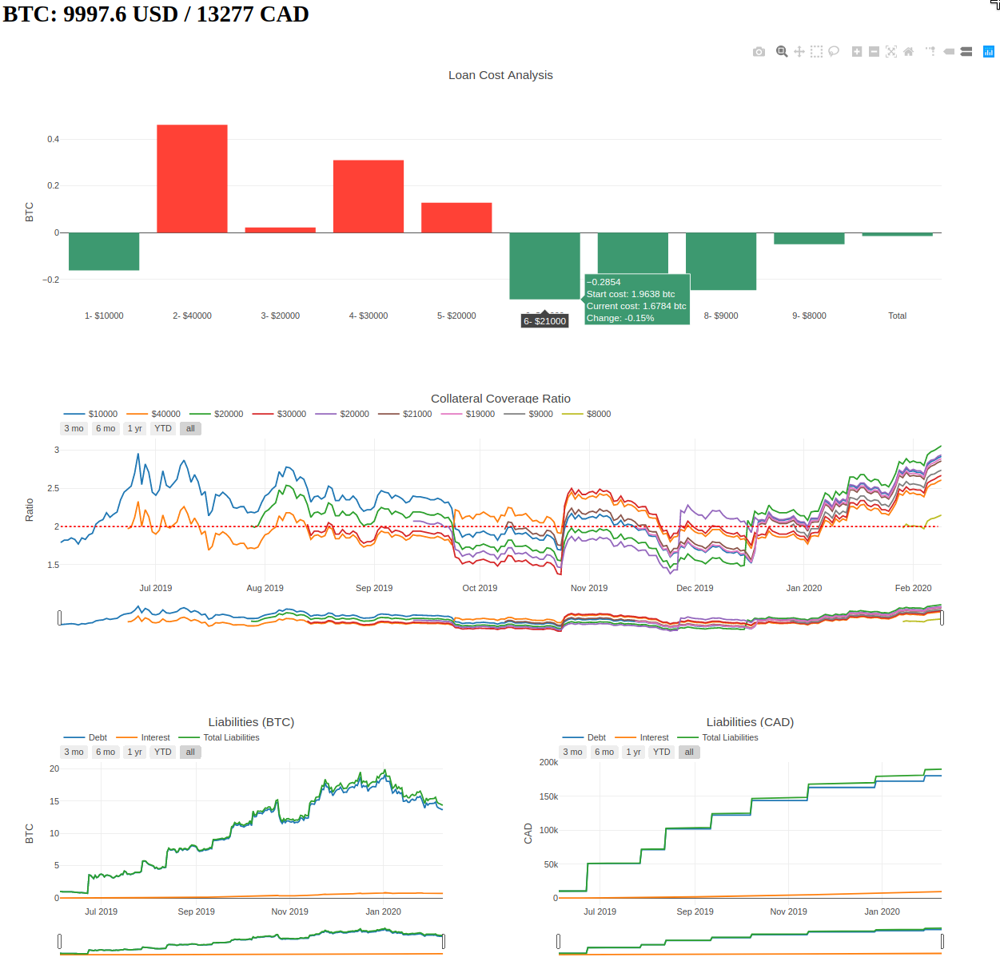

# CDP Stats Tool

This tool generates stats on Collaterized Debt Positions (CDP) using Bitcoin (BTC) as collateral.
The tool will obtain historic BTCUSD data information from Quandl and Bitfinex to calculate 
a Collateralization Ratio and use Bank Of Canada data (CADUSD exchange rate)
to calculate BTC prices in CAD. 



## Prerequisites

+ Clone this repository and install `requirements.txt`.

+ This program uses two files for loan and savings inputs.
  + Loan sample file provided at (`/cdp-stats/data/loan-sample.csv`). 
  #TODO: Create sample file
  + Savings sample file provided at (`/cdp-stats/data/savings-sample.csv`). 
  

### Loan file

To use your own data, create `/cdp-stats/data/loans.csv`, a file that will contain the following information for every movement in each CDP.

```
num,type,wallet_address,coll_amount,start_date,debt_cad,date_update,admin_fee
 ```

| CSV column   |Description|
| ---------|-----------|
| num      |(int) Consecutive counter used as entry ID | 
| type     |(int) type of CDP movement,|
| |`0` new new loan|
| |`1` collateral increase|
| |`2` collateral decrease| 
| |`3` debt (borrowed CAD) increased|
| |`4` closed loan|
|wallet_address|(str) Bitcoin address used to deposit collateral|
|coll_amount|(float) Amount of BTC increased/decreased by `type` movement|
|start_date| (str) Format:`YYYY-MM-DD`; Date loan became active|
|debt_cad|(float) Amount of CAD increased by `type` movement|
|date_update| (str) Format:`YYYY-MM-DD`; Date loan reflected `type` movement|
|admin_fee|(int) Fee charged at the start of loan|


#TODO: Replace num for id 


### Savings file

To use your own data, create `/cdp-stats/data/savings.csv`, such file will provide information of the BTC savings account movements.

```
num,type,amount_btc,date
 ```

|CSV column|Description   |
|----------|--------------|
|id        |(int) Consecutive counter used as entry ID  | 
|type      |(int) type of movement,|
|          |`0` amount of BTC savings increased|
|          |`1` amount of BTC savings decreased|
|amount_btc     | (float) Used when type is `0` or `1`, specifies BTC amount increased or decreased in savings account |
|date           | (str) Used for all `type` of movements, format: `YYYY-MM-DD`, specifies date when movement was executed |

```
id,type,amount_btc,date
1,0,1.0,2020-08-01
2,1,1.0,2020-08-10
```

### Interest Rates file

To use your own data, create `/cdp-stats/data/rates.csv`, such file will provide information on the APY interest rates offered by the savings account.
    
|CSV column|Description   |
|----------|--------------|
|id       |(int) Consecutive counter used as entry ID  | 
|date          | (str) format: `YYYY-MM-DD`, specifies date when new interest rate is reflected |
|interest_date | (float) APY interest expressed in decimal (6.5%, 4.3%, etc.) |

```
id,date,interest_rate
1,2020-06-01,4.1    
2,2020-08-01,6.5
```

## Running the application

To run the application (by default, uses for `/data/loans.csv` file),  

```
$ cd [HOME]/cdp-stats/src/
$ ./app.py
```

To run the application using a different input file data, run the application with `--f [input_file.csv]`.

To use the sample file provided, 

```
$ ./app.py --f ../data/loans-sample.csv
```

Open `http://127.0.0.1:8050/` in your web browser.

## Running the tests

To run the entire test suite,

```
$ cd [HOME]/cdp-stats/tests
$ ./runner.py all
```

To test specific modules,

```
$ ./runner.py loan
$ ./runner.py debt
$ ./runner.py tools
```

## Author

Daniel Olaya
