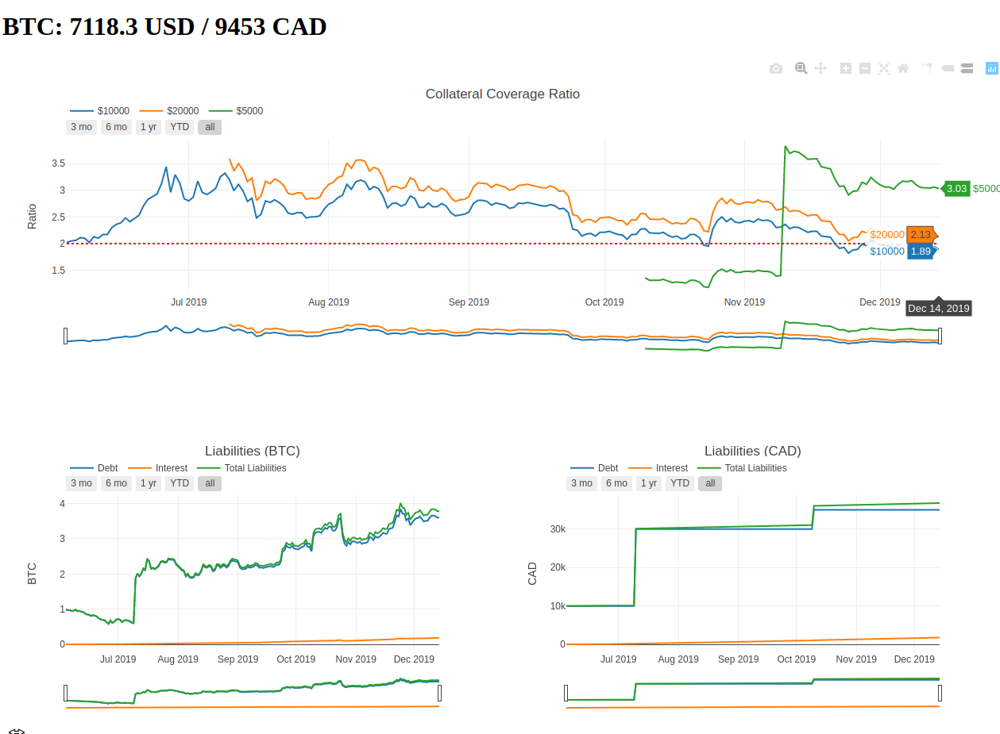

# CDP Stats Tool

This tool generates stats on Collaterized Debt Positions (CDP) using Bitcoin (BTC) as collateral.
The tool will obtain historic BTCUSD data information from Quandl and Bitfinex to calculate 
a Collateralization Ratio and use Bank Of Canada data (CADUSD exchange rate)
to calculate BTC prices in CAD. 



## Prerequisites

+ Clone this repository and install `requirements.txt`.

+ Create input file `cdp-stats/data/loans.csv`, which should contains the following information for every CDP.

```
num,type,wallet_address,coll_amount,start_date,debt_cad,date_update,admin_fee
 ```

| CSV column   |Description|
| ---------|-----------|
| num      |(int) Consecutive counter used as index | 
| type     |(int) type of CDP movement,|
| |`0` new new loan|
| |`1` collateral increase|
| |`2` collateral decrease| 
| |`3` debt (borrowed CAD) increased|
|wallet_address|(str) Bitcoin address used to deposit collateral|
|coll_amount|(float) Amount of BTC increased/decreased by `type` movement|
|start_date|(YYYY-MM-DD) Date loan became active|
|debt_cad|(float) Amount of CAD increased by `type` movement|
|date_update|(YYYY-MM-DD) Date loan reflected `type` movement|
|admin_fee|(int) Fee charged at the start of loan|


## Running the application

To run the application (by default, looks for `./data/loans.csv` file),  

```
$ ./app.py
```

To run the application using a different input file data, run the application with `--f [input_file.csv]`.
A sample input file has been provided, 

```
$ ./app.py --f ./data/loans-sample.csv
```

Open `http://127.0.0.1:8050/` in your web browser.

## Running the tests

To run the entire test suite,

```
$ ./tests/runner.py all
```

To test specific modules,

```
$ ./tests/runner.py loan
$ ./tests/runner.py debt
$ ./tests/runner.py tools

```

## Authors

Daniel Olaya
